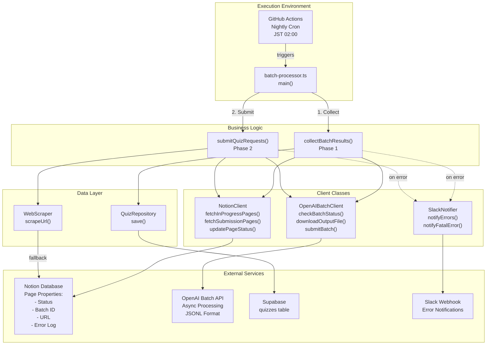

## 要約
Notionページを取得してOpenAI Batch APIで非同期クイズ生成し、結果をSupabaseに保存するフローは、GitHub Actionsで毎日JST 02:00に実行されるバッチ処理スクリプト `batch-processor.ts` によって実現されています [1](#0-0) 。
処理は2フェーズからなり、Phase 1で前回のバッチ結果を回収・DB保存、Phase 2で新規リクエストをOpenAIに送信します [2](#0-1) 。

## アーキテクチャ図

## フローの詳細

### 1. 実行環境とスケジュール
- GitHub Actionsが毎日UTC 17:00（JST 02:00）に `batch-processor.ts` を実行 [1](#0-0) 
- 手動実行も `workflow_dispatch` で可能 [3](#0-2) 
- 環境変数（OPENAI_API_KEY, NOTION_TOKEN, NOTION_DATABASE_ID, SUPABASE_URL, SUPABASE_SECRET_KEY, SLACK_WEBHOOK_URL, PLACEHOLDER_USER_ID）をGitHub Secretsから注入 [4](#0-3) 

### 2. Phase 1: 結果回収 (collectBatchResults)
1. `NotionClient.fetchInProgressPages()` で Status='InProgress' かつ Batch ID が存在するページを取得 [5](#0-4) 
2. Batch ID ごとにグループ化し、`OpenAIBatchClient.checkBatchStatus()` でバッチ状況を確認 [6](#0-5) 
3. 完了（completed）なら `downloadOutputFile()` でJSONLをダウンロードし、1行ずつパース [7](#0-6) 
4. `custom_id`（形式: `notion_page_{pageId}`）でページと結果を紐付け、`GenerateQuizResponseSchema` でバリデーション [8](#0-7) 
5. `QuizRepository.save()` でSupabaseのquizzesテーブルに保存し、NotionページのStatusを'Created'に更新、Batch IDをクリア [9](#0-8) 
6. バッチが失敗（failed/expired/cancelled）なら全ページを'Error'にしてエラーログを記録 [10](#0-9) 

### 3. Phase 2: リクエスト送信 (submitQuizRequests)
1. `NotionClient.fetchSubmissionPages(10)` で Status='Request' のページを最大10件取得 [11](#0-10) 
2. `getPageContent()` でNotionページ本文を抽出（100ブロックごとにページネーション対応） [12](#0-11) 
3. 本文が50文字未満かつURLプロパティがあれば `WebScraper.scrapeUrl()` でフォールバック取得 [13](#0-12) 
4. JSONL形式でバッチリクエストを構築（1行=1リクエスト、custom_id含む） [14](#0-13) 
5. `OpenAIBatchClient.uploadSubmissionFile()` でJSONLをアップロードし、`submitBatch()` でバッチを作成（completion_window: '24h'） [15](#0-14) 
6. 全ページのBatch IDを設定し、Statusを'InProgress'に更新 [16](#0-15) 

### 4. Notionステートマシンによる分散キュー
NotionページのStatusプロパティが状態機械として機能し、冪等性を保証します [17](#0-16) 。
- Request → InProgress（Phase 2でバッチ送信時）
- InProgress → Created（Phase 1で成功時）
- InProgress → Error（Phase 1で失敗時）
- Request → Error（コンテンツ抽出失敗時）

### 5. エラーハンドリングと通知
- ページ単位・バッチ単位・致命的エラーの3階層でエラーを収集 [18](#0-17) 
- 全エラーを `SlackNotifier.notifyErrors()` で集約通知 [19](#0-18) 
- 致命的エラーは `notifyFatalError()` で別途通知 [20](#0-19) 

### 6. Dry-runモードと実行方法
- `--dry-run` フラグでDB書き込みとNotion更新をスキップ可能 [21](#0-20) 
- ローカル実行: `npm run batch:check` / `npm run batch:check:dry` [22](#0-21) 

## Notes
- 本システムはStudioの対話型クイズ生成APIとは独立して動作し、OpenAI Batch APIの割引（50% OFF）を活用してコストを最適化しています [23](#0-22) 。
- Supabaseへの書き込みにはサービスロールキー（SUPABASE_SECRET_KEY）を使用し、RLSをバイパスしてプレースホルダーユーザー配下にクイズを保存します [24](#0-23) 。
- JSONLの1行あたりのリクエスト形式はOpenAI Batch API仕様に準拠し、custom_idでNotionページを追跡可能です [25](#0-24) 。
