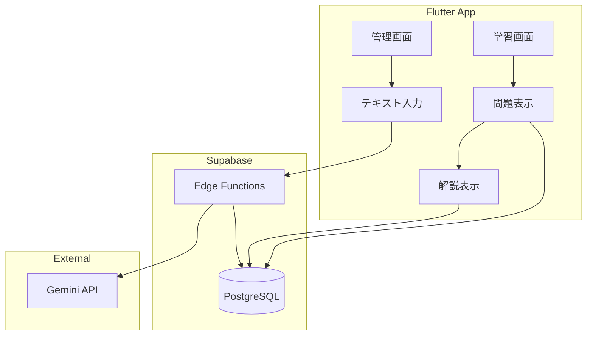

# 学習自動化システム - 技術選定と実装計画書

## 概要

Notion等のソースからAIが問題を自動生成し、忘却曲線に基づいた復習を強制的に行う個人専用学習システムを構築する。Phase 1 (MVP) では、手動テキスト入力からの問題生成と基本的な学習UIを実装する。

---

## 決定事項

| 項目 | 決定内容 |
|------|----------|
| AIモデル | Gemini 2.0 Flash |
| 認証 | Phase 1では認証なし（単一ユーザー） |
| プロジェクト配置 | 新規ディレクトリ |
| Supabase | 新規プロジェクト |

---

## 技術選定

### フロントエンド: **Flutter**

| 項目 | 選定理由 |
|------|----------|
| **クロスプラットフォーム** | iOS/Android/Webを単一コードベースで開発可能 |
| **状態管理** | Riverpod - 型安全で宣言的な状態管理 |
| **ルーティング** | go_router - 宣言的なナビゲーション |
| **データクラス** | freezed - 不変データクラスの自動生成 |

```yaml
# 主要依存パッケージ
dependencies:
  flutter_riverpod: ^2.6.x
  go_router: ^14.x
  freezed_annotation: ^3.x
  supabase_flutter: ^2.x
  google_fonts: ^6.x
```

---

### バックエンド: **Supabase** (BaaS)

| コンポーネント | 用途 |
|---------------|------|
| **Database (PostgreSQL)** | 問題・学習履歴の永続化 |
| **Auth** | ユーザー認証（将来対応） |
| **Edge Functions** | AI API呼び出し・スケジューリング |

> **なぜKtorではなくSupabase Edge Functions?**
> - 無料枠で十分（月50万回実行）
> - サーバー管理不要でコスト削減
> - PostgreSQL連携がネイティブ
> - Phase 1のMVPに最適

---

### AI: **Gemini API (gemini-2.0-flash)**

| 項目 | 詳細 |
|------|------|
| **モデル** | gemini-2.0-flash（高速・低コスト） |
| **無料枠** | 1日1500リクエスト |
| **用途** | テキストから複数選択式クイズを生成 |

---

## データベーススキーマ

```sql
-- 問題テーブル
CREATE TABLE problems (
  id UUID PRIMARY KEY DEFAULT gen_random_uuid(),
  question TEXT NOT NULL,           -- 問題文
  options JSONB NOT NULL,           -- 選択肢 [{id, text, is_correct}]
  explanation TEXT,                 -- 解説
  source_text TEXT,                 -- 元のソーステキスト
  source_url TEXT,                  -- ソースURL（将来用）
  genre TEXT,                       -- ジャンル・カテゴリ
  created_at TIMESTAMPTZ DEFAULT NOW()
);

-- 学習進捗テーブル
CREATE TABLE user_progress (
  id UUID PRIMARY KEY DEFAULT gen_random_uuid(),
  problem_id UUID REFERENCES problems(id) ON DELETE CASCADE,
  is_correct BOOLEAN,               -- 直近の正誤
  attempt_count INTEGER DEFAULT 0,  -- 回答回数
  last_answered_at TIMESTAMPTZ,     -- 最終回答日時
  forgetting_step INTEGER DEFAULT 0, -- 忘却ステップ (0,1,2,3,4 → 1,3,7,14,30日)
  next_review_at DATE,              -- 次回出題予定日
  is_hidden BOOLEAN DEFAULT FALSE,  -- 非表示フラグ
  created_at TIMESTAMPTZ DEFAULT NOW()
);

-- インデックス
CREATE INDEX idx_progress_next_review ON user_progress(next_review_at);
CREATE INDEX idx_problems_genre ON problems(genre);
```

---

## 実装フェーズ

### Phase 1-1: 基盤構築（2-3日）

#### Supabase設定
- [ ] プロジェクト作成
- [ ] DBスキーマ構築（上記SQL実行）
- [ ] RLSポリシー設定（MVPでは無効でも可）

#### Flutter プロジェクト初期化
- [ ] 新規Flutterプロジェクト作成
- [ ] 依存パッケージ追加
- [ ] Supabase接続設定

---

### Phase 1-2: 問題生成機能（3-4日）

#### Edge Function: `generate-quiz`
```typescript
// supabase/functions/generate-quiz/index.ts
// 入力: { text: string, genre?: string }
// 出力: { problems: Problem[] }
```

#### 管理画面 (Flutter)
- [ ] テキスト入力フォーム
- [ ] AI生成ボタン → Edge Function呼び出し
- [ ] 生成結果プレビュー
- [ ] DB保存ボタン

---

### Phase 1-3: 学習機能（3-4日）

#### 出題ロジック
- [ ] 今日出題すべき問題を取得するクエリ
  ```sql
  SELECT p.* FROM problems p
  JOIN user_progress up ON p.id = up.problem_id
  WHERE up.next_review_at <= CURRENT_DATE
    AND up.is_hidden = FALSE
  ORDER BY up.next_review_at
  LIMIT 10;
  ```
- [ ] 新規問題 + 復習問題の混合ロジック

#### 学習UI (Flutter)
- [ ] 問題表示画面（複数選択チェックボックス）
- [ ] 回答確認 → 正誤判定
- [ ] 解説表示画面（ソース参照リンク付き）
- [ ] 次回出題日の自動更新

---

### Phase 1-4: 統合・調整（1-2日）

- [ ] ホーム画面（未回答問題数表示）
- [ ] 動作確認・バグ修正
- [ ] UI/UXブラッシュアップ

---

## アーキテクチャ図



---

## 検証計画

### 自動テスト

| 対象 | テスト内容 | 実行方法 |
|------|-----------|----------|
| Edge Function | Gemini API連携の単体テスト | `supabase functions test generate-quiz` |
| Flutter | Widgetテスト（問題表示・回答UI） | `flutter test` |

### 手動検証

1. **問題生成フロー**
   - 管理画面でテキストを入力 → 「生成」ボタン押下
   - 期待: 複数選択式の問題が3-5問生成される
   - 「保存」ボタンで DBに保存されることを確認

2. **学習フロー**
   - 学習画面で問題に回答
   - 期待: 正誤判定と解説が表示される
   - 次回出題日が忘却曲線に基づいて設定される

---

## コスト見積もり（無料枠内）

| サービス | 無料枠 | 想定使用量 |
|---------|--------|-----------|
| Supabase Database | 500MB | 〜10MB |
| Supabase Edge Functions | 50万回/月 | 〜1000回/月 |
| Gemini API | 1500回/日 | 〜50回/日 |
