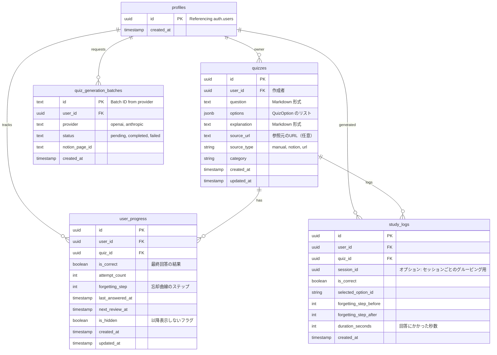

# Supabase データベーススキーマ設計案

このドキュメントでは、LearnLoop アプリケーションのデータベーススキーマ案を定義します。現在の MVP 要件だけでなく、将来の Phase 2 および 3（Notion 連携、分析機能など）の拡張性も考慮しています。

## 1. 概要

本スキーマは、以下の主要な概念を中心に構成されています：
- **Quizzes (クイズ)**: クイズの核心となるコンテンツ（問題文、選択肢、解説）。**作成者本人以外には一切非公開**とします。
- **User Progress (ユーザー進捗)**: 特定のクイズに対するユーザーの現在の学習状態（忘却曲線に基づくステータス）。
- **Study Logs (学習履歴)**: 分析用の不変な回答履歴（Phase 3 で活用）。

## 2. ER 図



## 3. テーブル定義

### 3.1 `profiles`
ユーザー管理用の最小限のテーブル。
- **RLS**: ユーザーは自身の行のみ挿入・参照可能。

| カラム名 | 型 | 説明 |
|---|---|---|
| `id` | `uuid` | PK, `auth.users.id` を参照。 |
| `created_at` | `timestamptz` | デフォルト `now()`。 |

### 3.2 `quizzes`
クイズのコンテンツを保存。
- **プライバシー**: 厳格に `user_id == auth.uid()` の制限をかけ、共有機能は持たせません。
- **容量節約**: 元のソーステキスト全体は保存せず、解説文 (`explanation`) のみで管理します。

| カラム名 | 型 | デフォルト | 説明 |
|---|---|---|---|
| `id` | `uuid` | `gen_random_uuid()` | プライマリキー |
| `user_id` | `uuid` | `auth.uid()` | 作成者（`profiles.id` への外部キー）。 |
| `question` | `text` | | 問題文 (Markdown 対応)。 |
| `options` | `jsonb` | | オブジェクトの配列: `{ "id": "uuid", "text": "...", "isCorrect": bool }`。 |
| `explanation` | `text` | | 解説文 (Markdown 対応)。 |
| `source_url` | `text` | | 参照元の URL（もしあれば）。 |
| `source_type` | `text` | `'manual'` | enum: `'manual'`, `'notion'`, `'url'`。 |
| `category` | `text` | | ジャンル/タグ (例: 'Docker', 'English')。 |
| `created_at` | `timestamptz` | `now()` | |
| `updated_at` | `timestamptz` | `now()` | |

**`options` の JSONB 構造案**:
```json
[
  {
    "id": "550e8400-e29b-41d4-a716-446655440000",
    "text": "正解の選択肢",
    "isCorrect": true
  },
  {
    "id": "...",
    "text": "不正解の選択肢",
    "isCorrect": false
  }
]
```

### 3.3 `user_progress`
ユーザーのクイズに対する**現在の習熟度**を追跡。
- **一意性**: `(user_id, quiz_id)` はユニークである必要があります。
- **復習アルゴリズム**: `forgetting_step` と `next_review_at` がスケジューリングの核となります。

| カラム名 | 型 | デフォルト | 説明 |
|---|---|---|---|
| `id` | `uuid` | `gen_random_uuid()` | プライマリキー |
| `user_id` | `uuid` | `auth.uid()` | `profiles.id` への外部キー。 |
| `quiz_id` | `uuid` | | `quizzes.id` への外部キー。 |
| `is_correct` | `boolean` | `false` | *直近*の回答結果。 |
| `attempt_count` | `int` | `0` | 合計回答回数。 |
| `forgetting_step` | `int` | `0` | 現在の忘却ステップ (例: 0-5)。 |
| `last_answered_at` | `timestamptz` | | 最終回答日時。 |
| `next_review_at` | `timestamptz` | | 計算された次回の復習予定日時。 |
| `is_hidden` | `boolean` | `false` | 「二度と出さない」フラグ。 |
| `created_at` | `timestamptz` | `now()` | |
| `updated_at` | `timestamptz` | `now()` | |

### 3.4 `quiz_generation_batches` (AI問題作成用)
コスト最適化のために Batch API を利用する際のジョブ管理テーブル。
- **RLS**: ユーザー本人のみがアクセス可能（または将來的にはシステムロールのみ）。

| カラム名 | 型 | 説明 |
|---|---|---|
| `id` | `text` | PK, バッチID (プロバイダー発行のIDを使用)。 |
| `user_id` | `uuid` | `profiles.id` への外部キー。 |
| `provider` | `text` | `openai` または `anthropic`。 |
| `status` | `text` | `pending`, `completed`, `failed`。 |
| `notion_page_id` | `text` | (任意) 連携元のNotionページID。 |
| `created_at` | `timestamptz` | `now()` | |

### 3.5 `study_logs` (Phase 2/3 機能)
**※ Phase 1 (MVP) では作成しません。**
すべての回答試行を記録する追記専用ログ。
- **目的**: 統計、グラフ表示、学習の可視化。

| カラム名 | 型 | デフォルト | 説明 |
|---|---|---|---|
| `id` | `uuid` | `gen_random_uuid()` | プライマリキー |
| `user_id` | `uuid` | `auth.uid()` | `profiles.id` への外部キー。 |
| `quiz_id` | `uuid` | | `quizzes.id` への外部キー。 |
| `is_correct` | `boolean` | | その回の正誤結果。 |
| `selected_option_id`| `text` | | ユーザーが選択した選択肢の ID。 |
| `duration_seconds` | `int` | | 回答にかかった時間 (任意)。 |
| `created_at` | `timestamptz` | `now()` | 回答日時。 |

---

## 4. 実装上の注意点

### 4.1 行レベルセキュリティ (RLS)
- **すべてのテーブル**:
    - RLS を有効化。
    - ポリシー: `user_id == auth.uid()` のデータのみ編集可能。
    - **特記事項**: `quizzes` テーブルについても、自身の ID と一致する作成者のみが参照・編集できるポリシーを徹底します。他人への共有機能は実装しません。

### 4.2 インデックス
- `user_progress`:
    - `(user_id, next_review_at)`: 「今日解くべきクイズ」のクエリを高速化。
    - `(user_id, quiz_id)`: 一意性制約および高速な検索に。
- `quizzes`:
    - `(user_id, category)`: カテゴリ別フィルタリング用。

### 4.3 Dart モデルとのマッピング

#### `Quiz` (Dart) -> `quizzes` (DB)
- `options` (Dart List) <-> `options` (DB jsonb)
- `genre` (Dart) <-> `category` (DB)
- `sourceUrl` はそのまま対応しますが、`sourceText` は DB には保存されません。

#### `UserProgress` (Dart) -> `user_progress` (DB)
- 1:1 で対応。

#### `QuizSession` (Dart)
- DB には保存しません。`user_progress` と `quizzes` を JOIN して動的に作成します。
